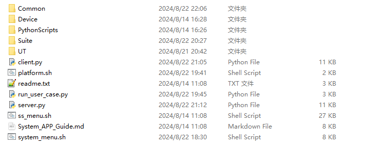
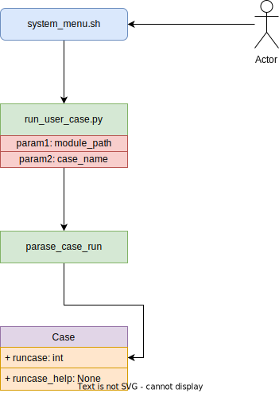

# System APP软件设计文档  

## 1. 文档基本信息  
- **文档标题**：System APP软件设计文档
- **项目名称**：system APP
- **版本号**：V1.0
- **作者**：Sigmastar
- **日期**：2024-08-22
## 2. 引言
### 2.1 背景
为了测试各种系统相关case保证SDK质量，方便管理case以及与ATP系统对接设计一套测试case管理系统。

### 2.2 范围
本文档覆盖system app的整体设计 ,包含菜单、server端和client端实现、以及设备管理。base case功能需参考wiki：

```
http://sswiki:8090/pages/viewpage.action?pageId=76495948
```

## 3. 系统概述
### 3.1 系统目标
- 能够添加case到菜单并运行case
- user运行case能够分别通过uart telnet与板端通信
- user接收到板端的数据不丢失
### 3.2 系统架构


## 4. 详细设计
### 4.1 架构设计
#### 4.1.1 组件设计
- server：与client端交互，与设备交互
- client：负责和server通信，给user提供接口
- run_user_case：user入口
- Device：用于管理不同类型设备，根据不同的通信方式和板端通信
- Common：存放公共API的组件
- UT：测试框架稳定性的case
- Suite：用于存放各个场景case的路径
- PythonScripts：其他python脚本，如，自定义print

#### 4.1.2 目录结构

预计目录结构如图：



### 4.2 接口设计
#### 4.2.1 外部接口

##### CaseBase

| API名                 | 简介                       | 注意事项                   |
| --------------------- | -------------------------- | -------------------------- |
| CaseBase              | 类：case基类，case通用操作 |                            |
| casebase.runcase      | 方法：用户执行case的入口   | 返回值需包含在ErrorCodes中 |
| casebase.runcase_help | 方法：帮助信息             |                            |

##### Client

| API名               | 简介                                       | 注意事项                   |
| ------------------- | ------------------------------------------ | -------------------------- |
| Client              | 类：用于创建设备                           | uart类型设备只能创建一个   |
| device_handle.write | 方法：向目标设备写入数据                   | 目标设备为handle注册的设备 |
| device_handle.read  | 方法：读取命令下发后目标设备返回的一行数据 |                            |

- write：向目标设备写入数据

```python
def write(self, data):
        """
        写数据

        Args:
            data: 写入的数据

        Returns:
            bool: True or False
        """
```

- read：读取设备数据

```python
def read(self, line = 1, wait_timeout = 5):
    """
    读取下发写命令之后的数据

    Args:
        line (int): 读取行数
        wait_timeout (int): 每行timeout

    Returns:
        bool,str: 前一次写命令之后的数据
    """
```

##### Common

system_common中通用的方法：

| API名                   | 简介                         | 注意事项 |
| ----------------------- | ---------------------------- | -------- |
| set_board_kernel_ip     | 在kernel设置ip               |          |
| set_board_uboot_ip      | 在uboot设置ip                |          |
| mount_to_server         | mount到执行文件夹            |          |
| goto_uboot              | 进入uboot                    |          |
| goto_kernel             | 进入kernel                   |          |
| match_keyword           | 匹配关键字所在的行           |          |
| write_and_match_keyword | 下发命令并匹配关键字所在的行 |          |
| cold_reboot             | 继电器下电再上电             |          |
| ensure_file_exists      | 保证文件存在，不存在则创建   |          |

- cold_reboot：继电器下电再上电

```python
    def cold_reboot(self):
        """
        控制继电器下电再上电

        Args:
            NA

        Returns:
            bool: True or False
        """
```

使用方法：

```python
# 导致system_common文件
import Common.system_common as sys_common

# 调用common中的方法
sys_common.cold_reboot()
sys_common.match_keyword(device, keyword)
```

> 说明：
>
> 如果common中没有找到对应的方法，可自行封装方法放入Common目录。
>
> 加入规则：
>
> 1.所有case通用的操作请放入system_common.py中
>
> 2.场景中通用的操作请放入xxx_common.py中，如果文件不存在可自行创建。

##### ErrorCodes

框架会根据return的错误码做不同操作，参考下表：

| return  | 结果 | 操作                                                      |
| ------- | ---- | --------------------------------------------------------- |
| SUCCESS | PASS | 无                                                        |
| FAIL    | FAIL | 无                                                        |
| REBOOT  | FAIL | 继电器上下电                                              |
| ESTAR   | FAIL | 重新烧录                                                  |
| TOLINUX | FAIL | 判断是否为linux，如果不是则切换到linux（AOV场景专属操作） |

定义：

```python
class ErrorCodes(Enum):
    SUCCESS    = 0
    FAIL       = 1
    REBOOT     = 2
    ESTAR      = 3
    TOLINUX    = 4
```

使用方法：

```python
# 导入ErrorCodes
from Common.error_codes import ErrorCodes as EC

# 在需要使用的位置使用
EC.SUCCESS
EC.FAIL
EC.REBOOT
EC.ESTAR
EC.TOLINUX
```


#### 4.2.2 内部接口

DeviceManager：设备管理

| API名                         | 简介                                       | 注意事项 |
| ----------------------------- | ------------------------------------------ | -------- |
| DeviceManager                 | 类：设备管理，管理server端与板端通信的设备 |          |
| DeviceManager.register_device | 方法：注册设备                             |          |
| DeviceManager.acquire_device  | 方法：获取设备                             |          |
| DeviceManager.release_device  | 方法：释放设备                             |          |


## 5. 部署与维护

用户通过菜单选择对应case之后的流程如下：



所以设计case时需要考虑：

1.如何将case加入到menu（system app）

2.如何设计Case对应的类

本章介绍如何设计case。

### 5.1 创建测试集合

在scripts_system/Suite下创建测试集合文件夹，类似于UT文件夹。

### 5.2 创建测试模块

#### 5.2.1 添加测试模块

测试集合下面添加测试模块文件夹和对应脚本。如，UT下面的api_test测试模块需要创建api_test文件夹和api_test.py脚本

#### 5.2.2 脚本内容

需在定义一个**文件名同名**的类并继承CaseBase的类

模块入口方法为runcase：

```python
# 带有时间戳和颜色的打印
from PythonScripts.logger import logger
# 导入常用的common CMD，可根据需要自行添加CMD到Common
import Common.system_common as sys_common
# case的基类
from Common.case_base import CaseBase
# 导入设备类，用于创建设备
from client import Client
# 导入错误码，避免返回不支持的错误码
from Common.error_codes import ErrorCodes as EC

# 创建与setup.sh中module_path_name同名的类并继承CaseBase类
class api_test(CaseBase):
    # 更新case 名称、case执行次数、case模块所在路径
    def __init__(self, case_name, case_run_cnt=1, module_path_name='./'):
        self.case_name = case_name
        self.case_run_cnt = case_run_cnt
        self.module_path_name = module_path_name

    # case入口，返回值请遵行错误码
    def runcase(self) -> int:
        # 错误码初始值
        err_code = EC.SUCCESS
        # 创建设备（支持uart、telnet）
        uart = Client(self.case_name, "uart", "uart")
        cmd = "ls"
        # 向设备中写入数据
        ret = uart.write(cmd)
        if ret is False:
            # 使用logger打印信息
            logger.error("Write test fail.")
            # 更新错误码
            err_code = EC.FAIL
        # 读取设备数据
        ret, data = uart.read()
        if ret is False:
            logger.error("Read test1 fail.")
            err_code = EC.FAIL
        else:
            logger.info
        # 返回错误码
        return err_code

    # case 帮助信息入口
    def runcase_help(self):
        logger.info("API test")
```

如果存在chip或defconfig相关的设定，可以自行决定单独维护case_name_var.py文件。

#### 5.2.3 添加模块到system app

测试模块文件夹下增加setup.sh文件，并添加stage、case_path、对应scripts等信息

内容：

```shell
#1: case_stage, 2: case_path, 3: script, 4: case_name 5: json_out onoff 6: log opt
AddCaseSystem 0x80 /Suite/UT/api_test "Suite/UT/api_test/api_test.py" api_test on
```

增加UT测试集下的setup.sh:

```shell
#!/bin/sh

source ./Suite/UT/api_test/setup.sh
```

加入到system_menu中的case_list:

```shell
case_list()
{
    if [ -z "${module_list}" ]; then
        module_list="reboot str str_crc ttff_ttcl os_switch stress_case"
    fi
    echo "[module_list] ${module_list}"
    for param in ${module_list}
    do
        source ./Suite/AOV/${param}/setup.sh
    done
    source ./Suite/UT/setup.sh
}
```

### 5.3 执行

新增的Demo测试集使用的stage是0x80：

```shell
./system_menu.sh stage=0x80
```

